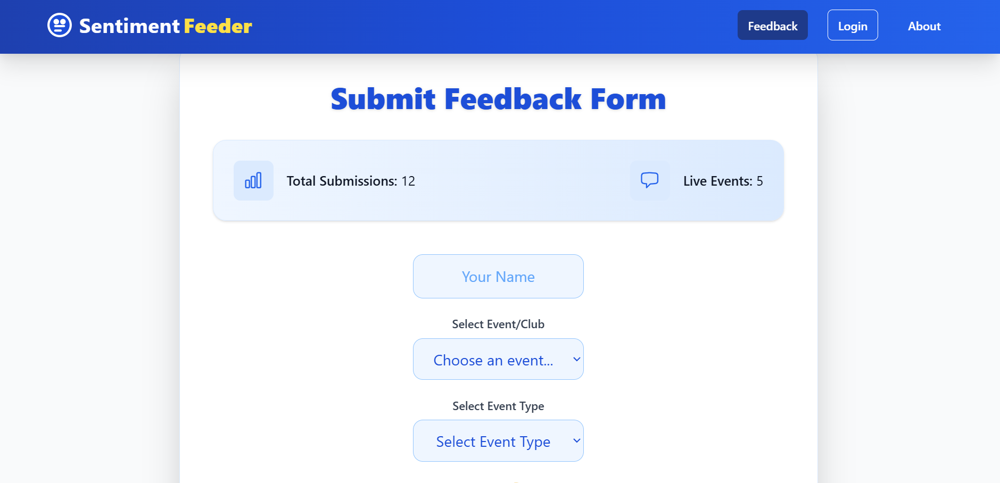
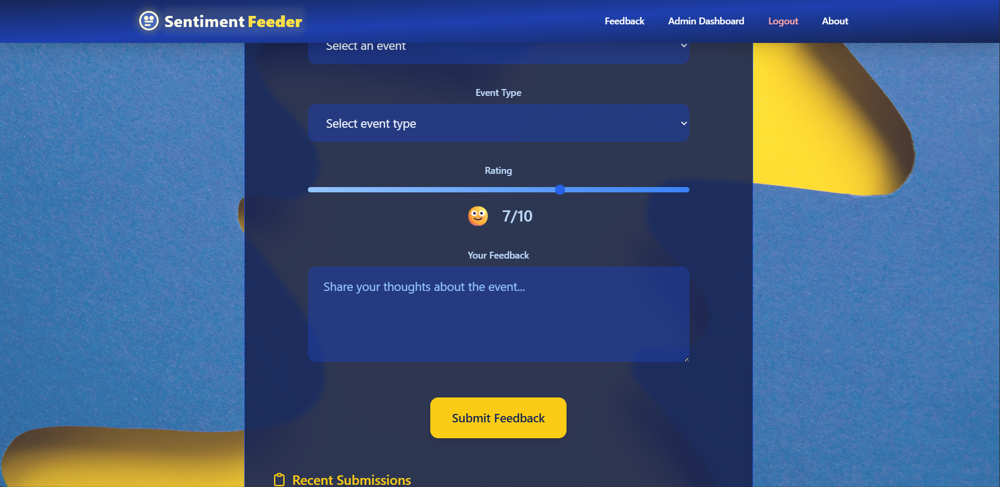
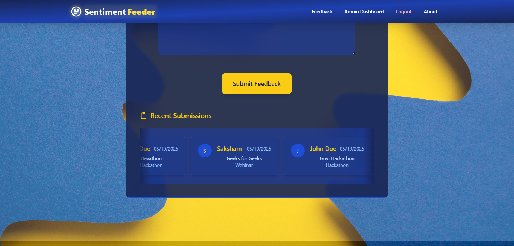
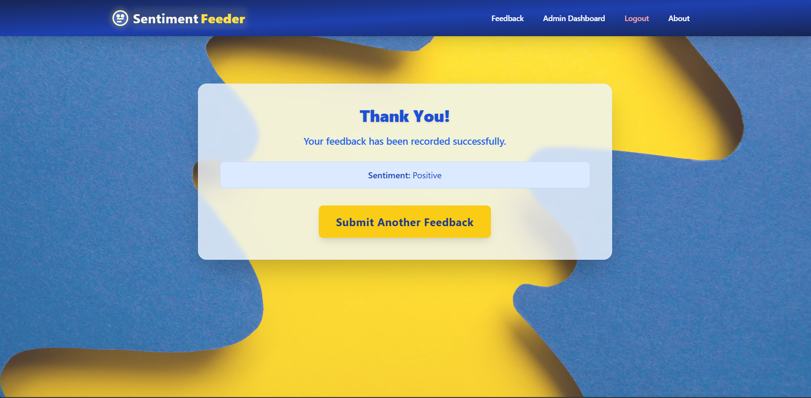
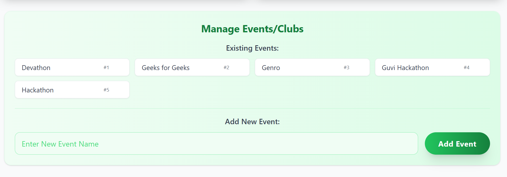
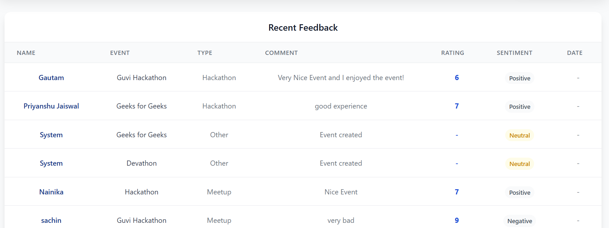
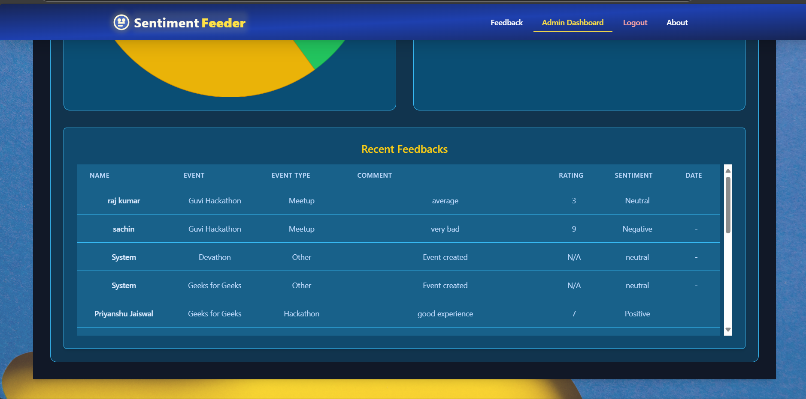
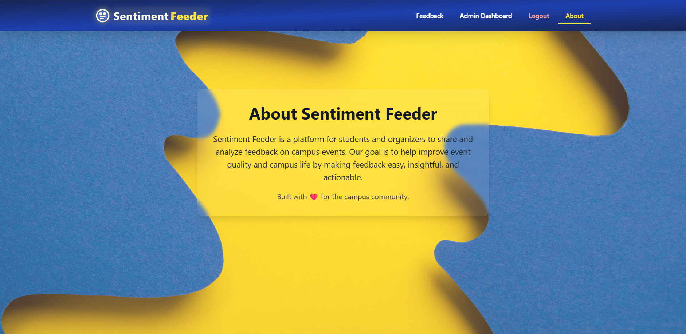

# Sentiment Feeder - Event Feedback Analysis Platform

## Problem Statement
In today's fast-paced event management landscape, gathering and analyzing feedback effectively is crucial for continuous improvement. Traditional feedback collection methods often face several challenges:

1. **Delayed Analysis**: Manual processing of feedback forms leads to delayed insights
2. **Limited Sentiment Understanding**: Basic feedback forms fail to capture the emotional context
3. **Data Silos**: Feedback data remains scattered and difficult to aggregate
4. **Real-time Monitoring**: Lack of immediate visibility into event success metrics
5. **Resource Intensive**: Manual analysis requires significant time and human resources

## Our Solution
Sentiment Feeder is a comprehensive event feedback analysis platform that leverages AI to provide real-time sentiment analysis and actionable insights. The platform helps event organizers:

- Collect and analyze feedback in real-time
- Understand participant sentiment through AI-powered analysis
- Track event success metrics through intuitive dashboards
- Make data-driven decisions for future events

## Key Features

### 1. Real-time Sentiment Analysis
- AI-powered sentiment analysis of feedback comments
- Categorization into Positive, Neutral, and Negative sentiments
- Instant visualization of sentiment distribution

### 2. Interactive Dashboard
- Real-time feedback monitoring
- Sentiment distribution charts
- Event-wise feedback analysis
- Customizable filters and views

### 3. Event Management
- Create and manage multiple events
- Track feedback across different event types
- Export feedback data for detailed analysis

### 4. User-friendly Interface
- Clean, modern UI with glassmorphism design
- Responsive layout for all devices
- Intuitive navigation and data visualization

## Technical Implementation

### Frontend
- React.js for dynamic user interface
- Tailwind CSS for modern, responsive design
- Chart.js for data visualization
- Axios for API integration

### Backend
- FastAPI for high-performance API
- MongoDB for flexible data storage
- TextBlob for sentiment analysis
- Rate limiting and security features

### Security Features
- API key authentication
- CORS protection
- Rate limiting
- Input validation

## Getting Started

### Prerequisites
- Node.js (v14 or higher)
- Python 3.8+
- MongoDB

### Installation
1. Clone the repository
```bash
git clone https://github.com/yourusername/Sentiment_Analysis_WebApp.git
```

2. Set up the backend
```bash
cd backend
pip install -r requirements.txt
```

3. Set up the frontend
```bash
cd frontend
npm install
```

4. Configure environment variables
- Create `.env` files in both frontend and backend directories
- Add necessary API keys and configuration

5. Run the application
```bash
# Backend
cd backend
uvicorn app.main:app --reload

# Frontend
cd frontend
npm start
```

## Future Enhancements
1. Advanced analytics with machine learning
2. Custom feedback form builder
3. Integration with popular event platforms
4. Automated report generation
5. Multi-language support

## Team
- [Your Name] - Full Stack Developer
- [Team Member 2] - Backend Developer
- [Team Member 3] - Frontend Developer

## License
This project is licensed under the MIT License - see the LICENSE file for details.

## Acknowledgments
- TextBlob for sentiment analysis
- FastAPI for the backend framework
- React and Tailwind CSS for the frontend
- Chart.js for data visualization

### Snippets 


-----------------------------------------------------------------------------------

-----------------------------------------------------------------------------------

-----------------------------------------------------------------------------------

-----------------------------------------------------------------------------------

-----------------------------------------------------------------------------------


-----------------------------------------------------------------------------------

-----------------------------------------------------------------------------------

-----------------------------------------------------------------------------------
